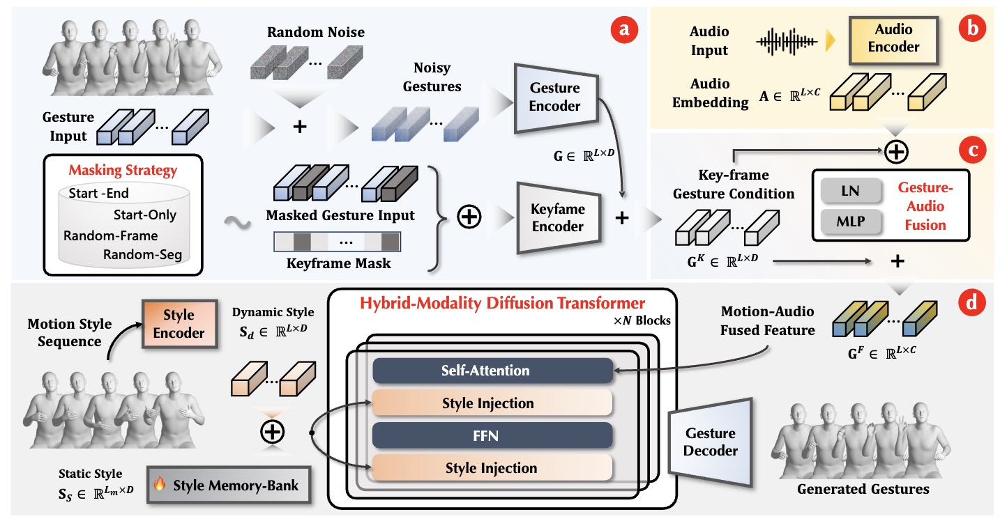
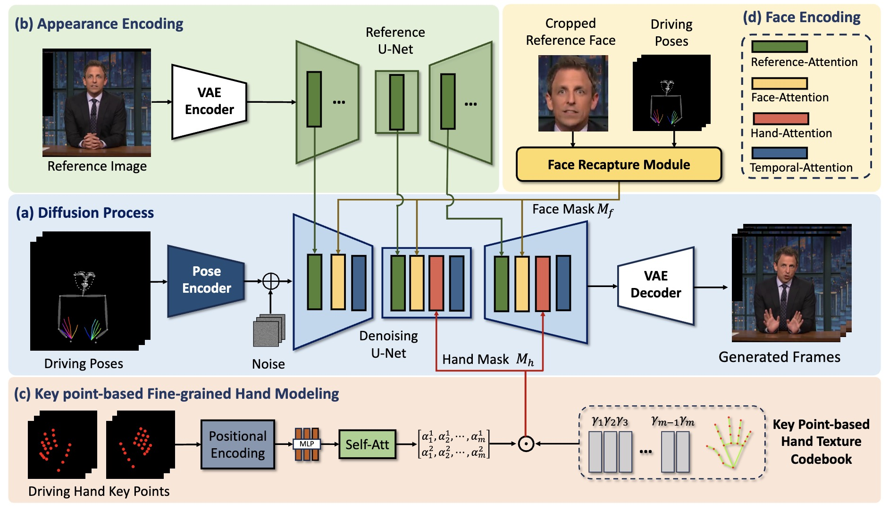
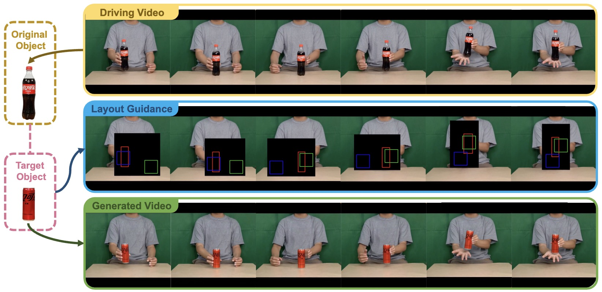
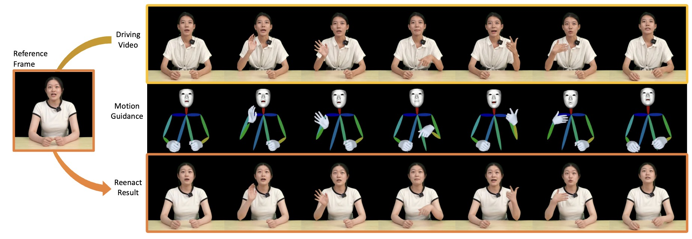








I am a final-year Ph.D. candidate in the Department of Electronic Engineering and Information Science, University of Science and Technology of China, supervised by <a href="https://imcc.ustc.edu.cn/_upload/tpl/0d/13/3347/template3347/xiehongtao.html">Prof. Hongtao Xie</a>. 
Before that, I graduated from the School of Artificial Intelligence, Xidian University with a bachelor’s degree. 

My research interest includes multimodal digital human synthesis, motion generation, and face-swapping. 

# 🔥 News
- *2025.06*: &nbsp;🎉🎉 Two papers is accepted by ICCV 2025.
- *2025.06*: &nbsp;🎉🎉 Two papers is accepted by CVPR 2025.
- *2025.01*: &nbsp;🎉🎉 One paper is accepted by Computer Graphics Forum 2025.
- *2024.09*: &nbsp;🎉🎉 One paper is accepted by NeurIPS 2024.
- *2024.09*: &nbsp;🎉🎉 One paper is accepted by TMM 2024.
- *2024.08*: &nbsp;🎉🎉 One paper is accepted by CVIU 2024.
- *2024.07*: &nbsp;🎉🎉 One paper is accepted by SIGGRAPH Asia 2024.

# 📝 Publications 

ICCV 2025

GestureHYDRA: Semantic Co-speech Gesture Synthesis via Hybrid Modality Diffusion Transformer and Cascaded-Synchronized Retrieval-Augmented Generation

**Quanwei Yang\***, Luying Huang\*, Kaisiyuan Wang, Jiazhi Guan, Shengyi He, Fengguo Li, Lingyun Yu, Yingying Li,
Haocheng Feng, Hang Zhou, Hongtao Xie.(*Equal contribution) 

[**Project Page**](https://mumuwei.github.io/GestureHYDRA/) <strong></strong>

NeurIPS 2024

[ShowMaker: Creating High-Fidelity 2D Human Video via Fine-Grained Diffusion Modeling](https://proceedings.neurips.cc/paper_files/paper/2024/file/5b0c0b2c2efdd736a53688ebfdc3bcdb-Paper-Conference.pdf)

**Quanwei Yang**, Jiazhi Guan, Kaisiyuan Wang, Lingyun Yu, Wenqing Chu, Hang Zhou, ZhiQiang Feng, Haocheng Feng, Errui Ding, Jingdong Wang, Hongtao Xie. 

[**Project Page**](https://mumuwei.github.io/ShowMaker/) <strong></strong>

- [Symmetrical Siamese Network for Pose-Guided Person Synthesis](https://www.sciencedirect.com/science/article/pii/S1077314224002157). **Quanwei Yang**, Lingyun Yu, Fengyuan Liu, Yun Song, Meng Shao, Guoqing Jin, Hongtao Xie. CVIU 2024
- [REMOT: A Region-to-Whole Framework for Realistic Human Motion Transfer](https://arxiv.org/pdf/2209.00475). **Quanwei Yang**, Xinchen Liu, Wu Liu, HongtaoXie, Xiaoyan Gu, Lingyun Yu, Yongdong Zhang. ACMM 2022

NeurIPS 2024

[Re-HOLD: Video Hand Object Interaction Reenactment via adaptive Layout-instructed Diffusion Model](https://arxiv.org/pdf/2503.16942)

Yingying Fan, **Quanwei Yang**, Kaisiyuan Wang, Hang Zhou, Yingying Li, Haocheng Feng, Errui Ding, Yu Wu, Jingdong Wang

[**Project Page**](https://fyycs.github.io/Re-HOLD/) <strong></strong>

NeurIPS 2024

[TALK-Act: Enhance Textural-Awareness for 2D Speaking Avatar Reenactment with Diffusion Model](https://arxiv.org/pdf/2410.10696)

Jiazhi Guan, **Quanwei Yang**, Kaisiyuan Wang, Hang Zhou, Shengyi He, Zhiliang Xu, Haocheng Feng, Errui Ding, Jingdong Wang, Hongtao Xie, Youjian Zhao, Ziwei Liu.

[**Project Page**](https://guanjz20.github.io/projects/TALK-Act/) <strong></strong>

- High Fidelity Face Swapping via Facial Texture and Structure Consistency Mining. Fengyuan Liu, Lingyun Yu, **Quanwei Yang**, Meng Shao, Hongtao Xie. TMM 2024
- THGS: Lifelike Talking Human Avatar Synthesis from Monocular Video via 3D Gaussian Splatting.Chuang Chen, Lingyun Yu, **Quanwei Yang**, Aihua Zheng, Hongtao Xie. CGF 2025
- Forensic-MoE: Exploring Comprehensive Synthetic Image Detection Traces with Mixture of Experts. Mingqi Fang, Ziguang Li, Lingyun Yu, **Quanwei Yang**, Hongtao Xie, Yongdong Zhang. ICCV 2025
- AudCast: Audio-Driven Human Video Generation by Cascaded Diffusion Transformers. Jiazhi Guan, Kaisiyuan Wang, Zhiliang Xu, **Quanwei Yang**, Yasheng SUN, Shengyi He, Borong Liang, Yukang Cao, Yingying Li, Haocheng Feng, Errui Ding, Jingdong Wang, Youjian Zhao, Hang Zhou, Ziwei Liu. CVPR 2025.
- High Fidelity Face Swapping via Semantics Disentanglement and Structure Enhancement. Fengyuan Liu, Lingyun Yu, Hongtao Xie, Chuanbin Liu, Zhiguo Ding, **Quanwei Yang**, Yongdong Zhang. ACM MM 2023

# 🎖 Honors and Awards
- *2025.07*, Baidu Outstanding intern
- *2022.09*, Longhu scholarship of University of Science and Technology of China
- *2020.07*, Outstanding Graduate of Xidian University
- *2019.08*, Meritorious Winner in the Mathematical Contest in Modeling for College students, USA
- *2018.10*, CASC scholarship of China Aerospace Science and Technology Corporation

# 📖 Educations
- *2020.09 - 2026.06 (now)*, Ph.D., Information and Communication Engineering, University of Science and Technology of China. 
- *2016.08 - 2020.06*, Bachelor’s degree, Intelligent Science and Technology. Xidian University,

# 💻 Internships
- *2023.11 - now*, VIS, Baidu, China.
- *2021.10 - 2023.04*, JD Explore Academy, China.
- *2020.07 - 2021.07*, MMU, Kuaishou, China.

